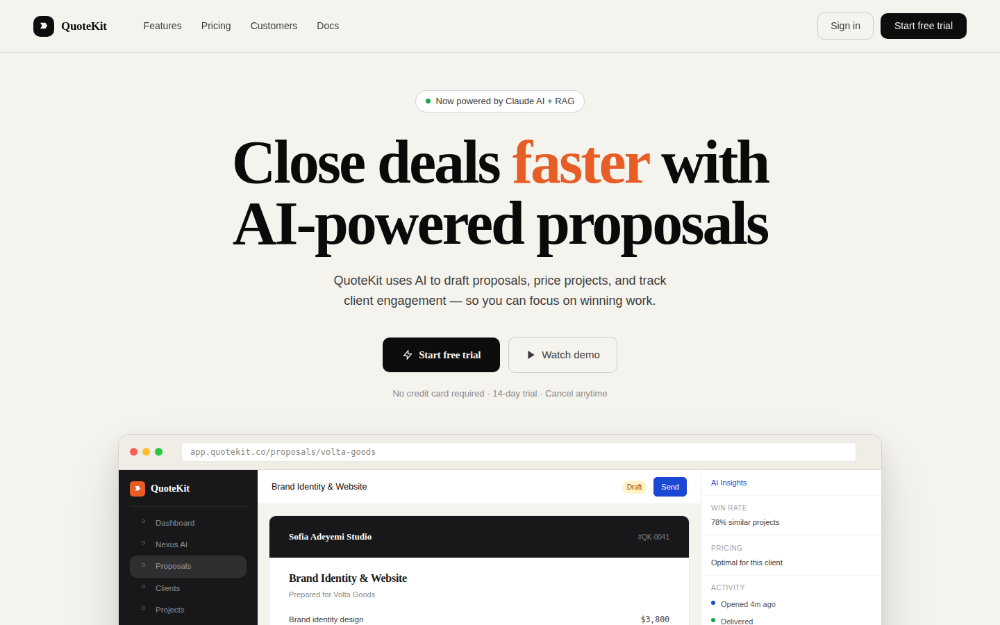

# QuoteKit

**A quote-and-proposal builder for small service businesses — quick proposals, an AI proposal assistant, a client portal, lead forms, and scheduling in one dashboard.**




## Overview
A web app for small businesses to build and send quotes/proposals quickly, track clients and projects, and run light CRM workflows.

## Problem
Small service businesses either send proposals ad hoc (email, PDF, no tracking) or pay for CRM suites built for much larger sales teams.

## Solution
A focused proposal builder with an AI drafting assistant, client portal, lead capture, and scheduling, sized for a small service business rather than an enterprise sales org.

## Key Capabilities
- Dashboard, proposal builder, "QuickPropose" fast-quote flow
- Client/project management, lead capture forms, scheduler, inbox
- Content library, automations, analytics
- Client-facing portal
- "Nexus AI" in-app assistant for drafting proposals from win-rate/pricing history

## Architecture
React/Vite frontend. Uses a clean environment-variable-based Supabase configuration (see `CLAUDE.md`) rather than a hardcoded project ID. **No backend is currently wired up** — all data, including the Nexus AI assistant's responses, is local/mocked.

## Technology Stack

| Layer | Technology |
|---|---|
| Frontend | React, Vite |
| Backend | Supabase (env-var configured, not yet connected to real data) |

## Repository Structure
- `src/app/components/pages/` — main app screens (Dashboard, Builder, Clients, Projects, Scheduler, NexusAI assistant)
- `src/app/components/auth/` — login/auth guard
- `src/i18n/` — localization

## Getting Started
```bash
npm i
npm run dev
```

## Project Status
Frontend substantially built out across most core flows; not ready for real customer use — no backend, mocked AI responses, unverified auth.

## Roadmap
- [ ] Wire up a real backend/data layer
- [ ] Connect Nexus AI to a real model (currently simulated)
- [ ] Auth hardening (`AuthGuard`/`LoginPage` shell exists but is unverified)

## Contributing
See the [org-wide CONTRIBUTING.md](https://github.com/creova-gif/.github/blob/main/CONTRIBUTING.md).

## License
Proprietary — © CREOVA. All rights reserved.

## Author / Organization
Built by [Justin Mafie](https://github.com/creova-gif) under CREOVA.
